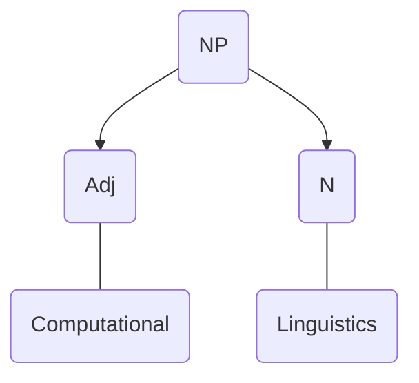

**Grading Scheme**

| Component | Weightage |
| ---- | ---- |
| Assignments | 20% |
| Seminar | 5% |
| Project | 25% |
| Midsems | 20% |
| Endsems | 30% |
Seminar:
Seminal Papers
Project:
starting this month

Lectures
[[4.1|4.1]]
[[8.1|8.1]]

Jurafsky and Martin

Course Goals:
to build intermediate models that can be used later in NLP to make a full scale model

The focus will be on Linguistics not Processing as in NLP

**Applications**
* Encryption/Decryption (In the war)
* Machine Translation

Computational Phonology
Computational Morphology
Computational Syntax
How to analyse sounds, words, and sentences.
