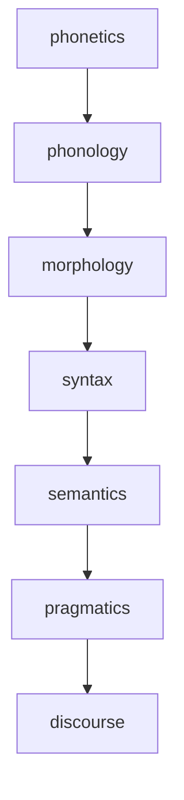
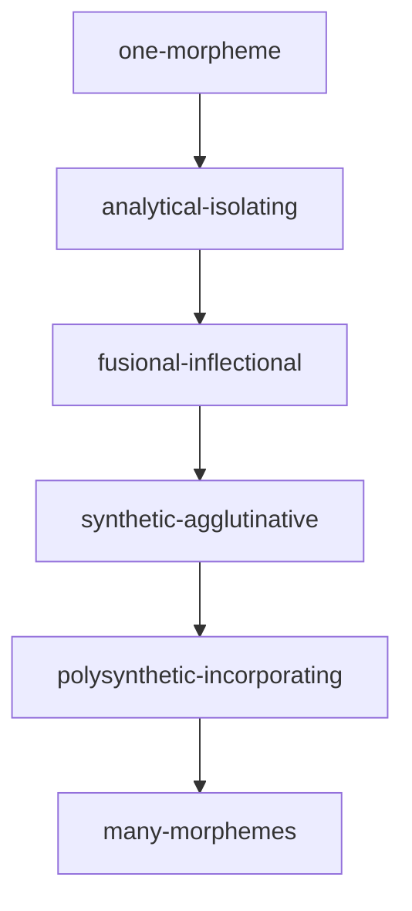

Why is it important to understand the sentence structure?
Parsing

Grammar \= *Linguistic Knowledge* in the speaker's mind 

We have this hierarchy in linguistics.

Syntax is a tool to understand grammatical vs. ungrammatical sentences. well-formedness vs. ill-formedness

But, sentences like
"The pen is happy" are perfectly grammatical, but semantically strange.

On the other hand, ungrammatical sentences like "My students is angry" or " I saw the girl tall" directly violate syntactic rules or principles, although they might be semantically more comprehensible.

Syntactic parsing cannot resolve grammatical but semantically strange or impossible sentences. However, it does help in identifying or resolving ungrammatical or ambiguous sentences.

Thus, gpt models like chatgpt have a good grasp of syntax (and vocabulary), but cannot go beyond into semantics yet.

**Analytic vs Synthetic**
**Morphological Typology**
**Morphemes per Word**

\* means more than one
**Phrasal Categories**
1. Noun Phrase
	1. NP = (det) + (adj\*) + N + (PP\*)
2. Prepositional Phrase
	1. PP = P + (NP)
3. Verb Phrase
	1. VP = V + (NP\*) +  (PP\*) + (adv\*)
4. Sentence
	1. S = NP + VP

**Structure of Clauses**
1. Independent Clause (matrix clause)
	1. Expresses complete sense. 
	2. It is finite.
	3. Ex. *I eat food.*
2. Dependent Clause (subordinate clause)
	1. Does not express complete sense.
	2. It is non-finite
	3. Ex. *If I go out*, I usually take my umbrella.
	4. 

Ditransitive verb phrases can have multiple NPs.
Ex. I gave her that.
She will gift that man a bouquet.

**Domain**
Also consider the domain and the type of your source data. Understand it before analysing or processing it.
**Bias**
It is important to consider all the biases involved in the language and linguistic processing. There may be some intrinsic personal biases, cultural biases, or social biases. There may even be inherent bias in language. It is not only our responsibility to consider diverse voices and languages, as well as the indigenous people's perspectives, but it is our duty. It will also help us build more inclusive and efficient models.

Chomskian theory, Xbar theory

the negative markers or verbforms are often derived from separate verbs, especially for dravidian languages.