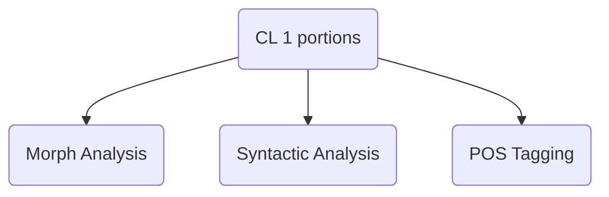

**Morph Analysis**
Steps
1. The input text is tokenized (usually words)
2. The tokens are morphemically divided
3. Each of the possible morphemic divisions are described.

**Stemming**
Finding the root morpheme of each token.

**Stop Words**
They do not contribute much 'content' to the sentence. These are function words.

**POS Tagging**
Automatic assignment of descriptions of the parts of speech.

Mostly Rule Based models will be taught, but statistical models will also be explored.

Mother tongue, or Hindi ig.
Python and google collab

wx notation