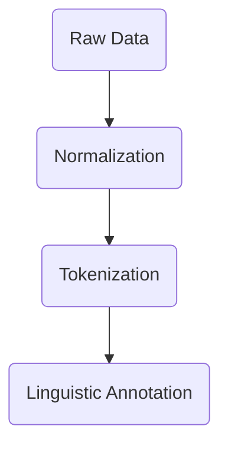
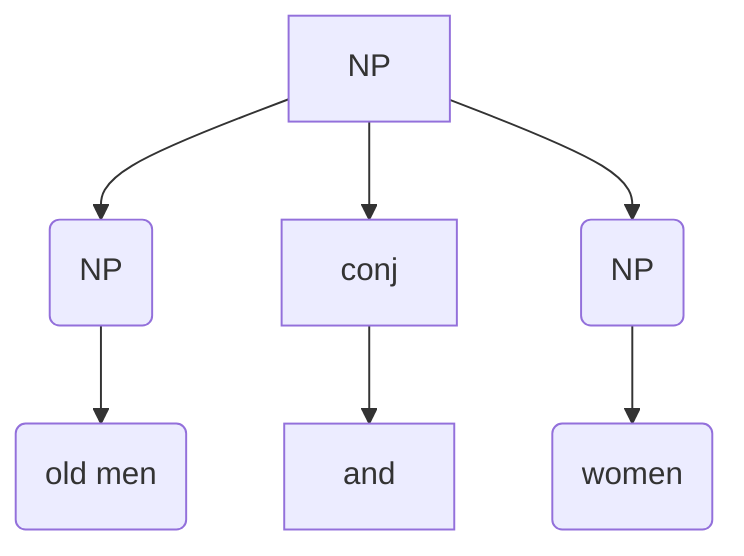

**Linguistic Data**
* It is the main source for linguistic resource.
* The data, when collected, is raw and not clean. It often has a lot of 'noise'.
* I.e. the raw data has a lot of unnecessary elements.
* When Data is *crawled* from the internet.
* Normalization is a very important step in data collection. Ex. spelling variations in different varieties.

Pre-Processing steps

**Core Technologies**
* Language Modelling
* POS Tagging
* Syntactic Parsing
* Named-Entity Recognition
* Coreference Resolution
* Word Sense Disambiguation
* Semantic Role Labelling
**Applications**
* MT
* Information Retrieval/Extraction
* Q&A
* Dialogue Systems
* Summarization
* Sentiment Analysis

Attachment and coordination

The data must be annotated before giving it to the model.

**Anaphora** 
*Backreference*
**Cataphora**
*Frontreference*

I opened the door.
The door opened.

The *door* plays the same role of the theme in both sentences. The semantic role is the same. But the door cannot play the role of an agent as *I* does.
Languages are loaded with ambiguities.

Universal Dependency
Every sentence has a root, to which all the elements are connected/ related.

For western languages, these two are also common.
Lexical Function Grammar (LFG)
Head Driven Functional Grammar (HDFC)

For Indian languages, the Paninian Dependency Grammar is common.

**Ambiguity**
1. ==Word senses==
	1. ==bank==
2. ==POS== 
	1. ==flies (the noun or the verb)==
3. ==Syntactic Structure==
   ==I saw a man with a telescope==
4. ==Quantifier scope==
   ==Every child loves some movie.==
5. ==Micture (Multiple)==
   ==I saw her duck==

**Linguistic Diversity**
Language specificity and cultural elements. Humans are multidimensional. It is uncertain whether artificial language models can be taught to absorb such context which is beyond text and speech.

**Sapir-Whorf Hypothesis**
The language we speak both affects and reflects our view of the world.
We should not let bias affect our technology.

Konkani Verb Conjugations
* Use gender
* Use number
* Do not use person.

| Person\Number | Sg  | Pl  |
| ------------- | --- | --- |
| 1             |     |     |
| 2             |     |     |
| 3             |     |     |