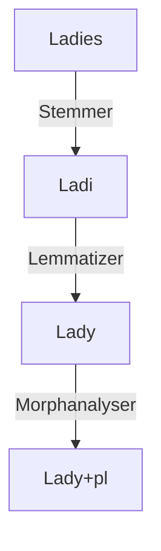

1. Stemmer
2. Lemmatizer
3. Morphological analyser

Basic Morphanalysis
1. I have played cricket.
2. I played cricket
3. I went
4. I have gone

played--> play + past/participle
gone--> go + participle
went--> play + past

every verb encodes (_tam_) tense, aspect, mood in English
nouns encode number, person, gender (_png_) in English
case markers are seen only nominals (nouns, pronouns, number words). case markers may be syntactic or morphological. they offer some semantic meaning

1. aspect - relative to the temporality at that time
2. tense -  "absolute" to the current temporality
3. mood - modality

There is always some ambiguity in the analysis. It is the model's job to disambiguate them.

1. taller: tall (adj) + comp
2. winter: winter (sg, n)
3. appointment: appointment (sg, n)
4. disagreements: ((dis (neg: derivational) + agree(v)) + ment (n)) + pl
5. jumps: jump (n) + pl or jump (v) + 3rd person sg

vʌtːäsə vʌt͡ʃənäsə
vʌtːä vʌt͡ʃːənä

gɛlːä vʌt͡ʃəni

vʌtːä äsilɔ vʌt͡ʃənä äsilɔ
gɛlːɔ vʌt͡ʃəni

gɛlːälɔ vʌt͡ʃəni äsilo/gɛlːälɔ nʌĩ

vəsə vʌt͡ʃːunʊkːä
vət͡ʃä̃ vʌt͡ʃæ näkːä

d͡ʒäi nɐkːä

suppletive forms

stem: ladi (in ladies) root lady
suppletive: went 

Issues in Tokenization

1. Blindly removing punctuation: m.p.h, Ph.D, AT&T, cap'n, etc.
2. prices: $45.55
3. dates: 01.02.06
4. URLs
5. Hashtags
6. emails

One solution may be to normalize before processing.
 USA vs U.S.A
 am, is, be, are 

Lemmatizer: represent all words as their dictionary headwords
Stemmer: Isolates the stem
Morphological Analyser: identifies the root of the stem and the other grammatical informations

**Computational Morphology**
Each element that you tokenize should have meaning.

1. Hyphenation
2. Spell Checking
3. Stemmers
4. MT
5. QnA
6. Content Analysis
7. Speech Synthesis

Very often, NLP technology is only effective for the current language situation. Language models should be sustainable. They should be applicable, let's say, even 20 years down the lane. It should be able to keep up with such minor changes in language.

NLP does not work on the knowledge of cognitive functioning. Instead, it uses data science (corpus-based learnings). 
The first morphological analysis was by Panini's Astadhyayi. 

--> Understand what the people needs. 
--> the social impact is the important
