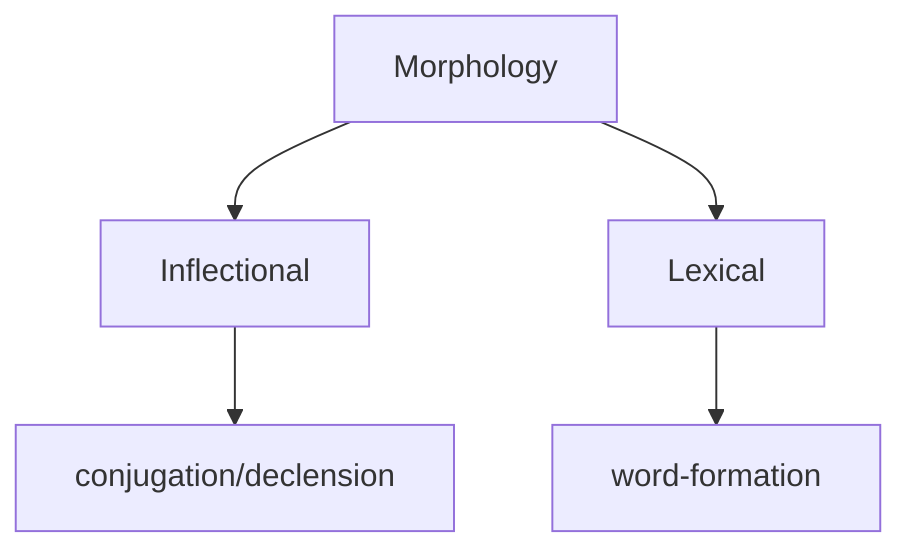
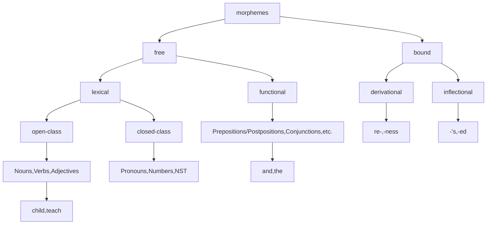
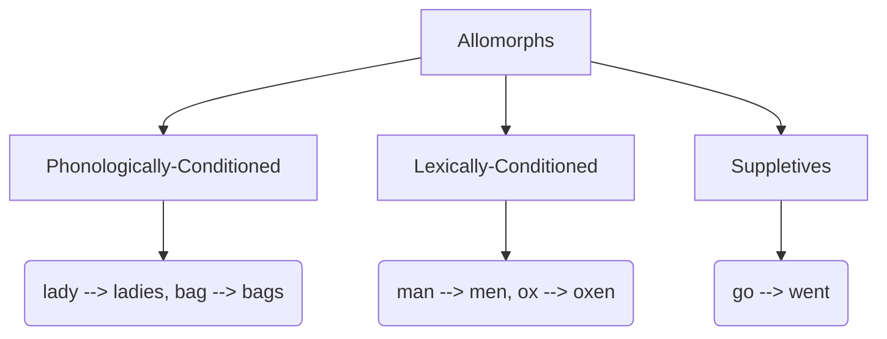

```python
 = re.findall(r'[^[A-Za-z]$+^\d+[.allchars]]', input)
```

How do we handle 'out of vocabulary' instances?

how do we go beyond text and speech and perform the analysis on prosody?

The type token ratio of a given day's worth of speech in any one individual, is usually very low. Like 500 or 1000 or less.

**Null Hypothesis**
A hypothesis that is assumed given the current situation, but may be disproved later on.
Initially, the null hypothesis in morphology was that since every word in a language may be stored and accessed when required.
However, only the number of attested words is finite. The number of possible words is infinite. 
Native speakers:

1. create compound words (derive)
2. possess intuitive knowledge about words 
3. use related words with new nuances
4. reject 'illformed' words : oxen, but not \*oxs, cats, but not \*caten.


| Inflection | Derivation |
| ---- | ---- |
| It readies a word for participation in a sentence. | It adds a semantic nuance to a word. |
| It may only be done once. | It may be done multiple times, but never after inflection. |
| It does not change the word class. | It may change the word class. |
| There is *infinite* possible productivity. (any lexical morpheme can and must be inflected) | There are finite *permissible* productivity. (some lexical morphemes cannot be derived upon) |



NST - nouns of space and time
ఇక్కడిక --> ఇక్కడికి రా 
అక్కడికి --> అక్కడికి వెళ్ళు.
here, 'here' and 'there' have been declined as if they were nouns.
tɛdnät͡ʃæ veːɭu

I am swimming. (ing is an inflection here)
Swimming is fun. (ing is a derivation here)
free lexical morphemes can take bound inflectional morphemes (or derivational). free functional morphemes cannot take any other morphemes.
transitive verbs require/take an object
intransitive verbs (can/) do not take an object


Non-Concatenative phenomena
Semitic languages have a root template morphology.
Some languages may not have enough in the text for processing.

Natural language purism has never worked. Prescriptivism is not the solution.


