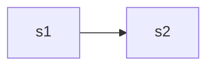

**Morphological Typology**
*Synthetic Languages*
many morphemes are joined to form words.
*Analytic Languages*
many words are realised as independent morphemes or mono morphemic segments.

Languages exist on a scale, a spectrum, between these two poles. This should also be considered.

*Isomorphic features*
features that are 'shared' or that evolve in both or are borrowed from one to another, often because of geographic proximity.

*Isolating Languages* (Analytical)
There are no bound forms. Each word consists of a single independent morpheme. Most often, a morpheme is equivalent to a word. They rely heavily on syntax and word order.
morpheme = word
Ex. Chinese, Vietnamese, Yoruba, Fijian, English

*Inflectional Languages* (Fusional)
Many features are merged into a single bound form, which is known as the *portmanteau* morph.
Ex. Sanskrit, Greek, Latin, Russian

*Agglutinative Languages* (Synthetic)
morpheme < word
Many morphemes are used in single words, and very often they can be 'stringed together'.
Ex. Dravidian Languages

*Incorporating Languages* (Polysynthetic)
They are morphologically very complex. Syntax and context is often less important.  Inflections are *incorporated* into words. All bound forms are affixes. Morpheme boundaries are difficult to determine.
Ex. Icelandic, Aleutian, Inuktitut, Yup'ik

**Hockett's Theory**: Design features of language (1954)

Three models describing morphological formations were proposed.
1. Item and Arrangement (IA)
	Morpheme Based Morphology
	It is conceived as object oriented concatenation. There is no notion of basic allomorphs, i.e., allomorphs are analysed as (unrelated) morphemes. 'cut and paste method'.
	This causes problems for conditioned allomorphs, let alone suppletives, because the relationship between allomorphs is not preserved.
	
2. Item and Process (IP)
	Lexeme Based Morphology
	There is a notion of allomorphs. It applies inflectional rules to the lexeme and outputs the word-form.
	Suppletives, however, cannot be mentioned as separate inflectional rules.
	
3. Word and Paradigm (WP)
	Word Based Morphology
	It requires both morpho-phonemics  and morpho-syntax, and includes MA and MG
	Paradigm is the central notion. All the related inflected forms of a word form a single paradigm. All the allomorphs can be stored as add-delete values. For example for 'went' from 'go', (+went, -go).
	Ex. let us consider some lexemes of verbs with their paradigms (add-delete values). 
	
	GO = (go, goes, went, gone, going)
	PLAY = (play, plays, played, played, playing)
	BE = (am/are, is, was/were, been, being)
	Now, for example, many regular verbs can be stored in the same paradigm as PLAY, i.e. since it follows the same set of (morpho-phonemic) rules
	
	The paradigms consist of the verb forms and their associated rule. This is called a morpho-syntactic paradigm, and have morpho-phonemic rules for each element position in the paradigm, and the morpho-phonemic rule together is constructed by the individual morpho-phonemic rules for all the words in all the paradigms at that position (about that rule).
	
4. a

Morphanalysis using Apertium, Finite State Automata

Paradigms are represented using finite state automata. A Finite State Automaton is a machine that works on a single tape.
FST (Finite State Transducer) It has two tapes, an input tape and an output tape. And hence, reversing the tape gives us an analyser. Morphological generation and analysis are hence inverse processes, but generation is most often deterministic, and analysis is ambiguous.

Create FST

