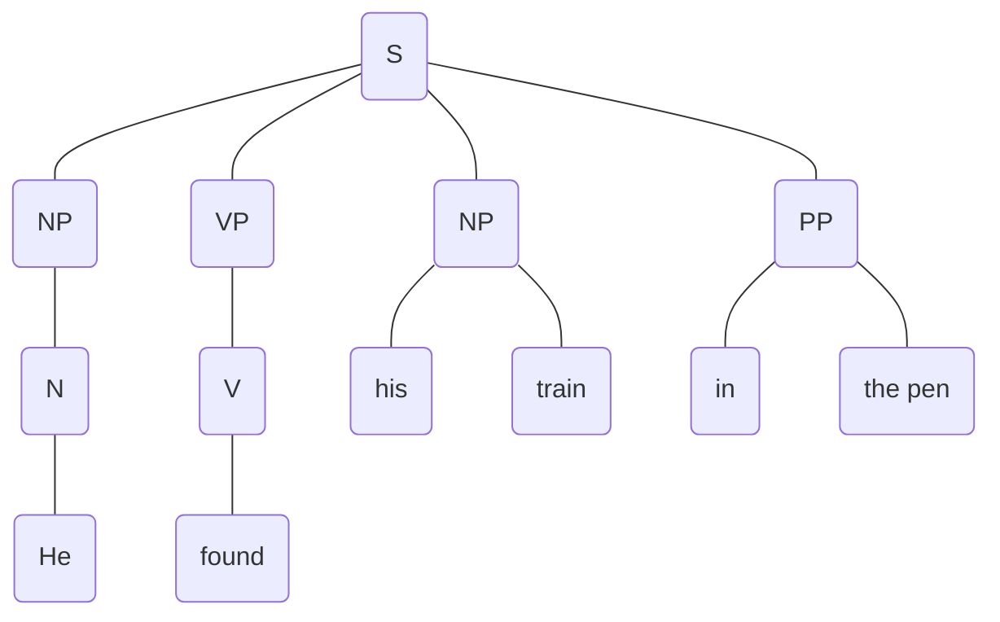
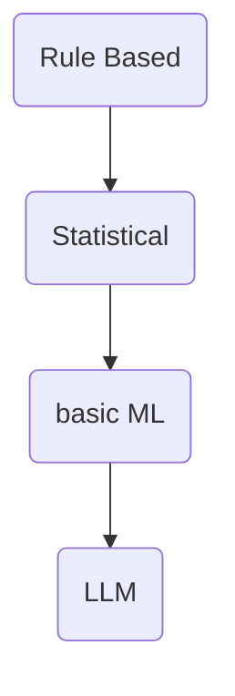

There is no one-one correspondence between two languages while attempting machine translation. Language is not always logical. In addition, there are many ambiguities and nuances inn languages which may be lost in translation. It is also important to consider the socio-cultural contexts while analysing data.
In the 1970s, the US dedicated plentiful resources to computational linguistics in the hopes of developing machine translation or question answer systems.

Warren Beaver
Consider the sentence

Although the sentence is completely correct grammatically, it appears semantically strange.

First, we must place it in the context it is found in. Let us say the train is a toy in a play pen. Now it appears meaningful.
**Selectional restriction**
Finding the correct semantics of a sentence based on the context that a particular sentence is found in.

Is the 'he' and 'his' the same? Let us say 'He' is the father of the child 'his'.
**Anaphora Resolution**
Finding the correct backreferences to disambiguate cases like that of pronouns.

These two were the places in which the machines were failing in Warren Beaver's studies. They stopped the funding to CL. Hence, good Anaphora Resolution and Selectional Restriction are essential for any MT or QA.

-----
Until 1970s, Linguistic research was restricted to publishing grammars like the Paninian Astadhyaya. These 'rules' distanced the common people's languages, which greatly hindered linguistic studies. Natural Languages involve error and slang and ungrammatical constructions.

**Raw Data**
Data as it is collected.

**Annotation**
* Some linguistic information is available about the Raw Data. Ex. POS Tagging is a great asset. 
* People annotate the data. Two Annotators may disagree on some interpretation of the data. 

**ELISA** (1970)
* Rogerian Psychotherapist chatbot
* Uses simple regular expressions
* Simple pattern matching to your previous responses
* Ancient ChatGPT
**Systram**
* Ancient Google (Search Engine)

**Internal Language** (I language)
Human Competence, language in the mind
This language can be studied in cognitive studies

**External Language** (E language)
Uttered/produce language. 
This is the data which is processed in NLP.
UG
Principles 
Parameters
John Vyan

Indian Languages have stronger agreements. This makes it easier to drop information. For ==Example, \[dɪːnä\] vs I will not give it to you.==
Also, different languages have different patterns and different exceptions. 
Also, language is productive. There is no finite limit to what sentences or words can be produced.
This lead to work on rule based and then statistical approaches to MTNLP.
Semantic Information, Discourse Information, etc. can be annotated to the data. 
Then, large amounts of data started to be used. Today there is abundance of Data. Hence, we can do basic ML instead, and build AIs.
2022 Nov: LLM (ChatGPT)
ML is a "Black Box". One cannot simply change an output. The model must be retrained on vast volumes of data. (or change the method)
(debiasing)

Until now, we had human generated data sets. Now, we have vast sources of machine generated data.

In CL, the objective is often forgotten. The methodology takes the spotlight. Rule based is sometimes more accurate. We should keep our goals in mind and then select the appropriate methodology. "I have a problem, how do I solve it?" rather than "This new method  is there, what can I research with it?"