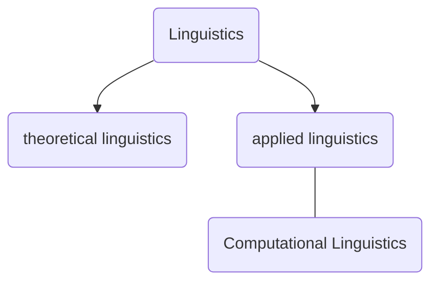
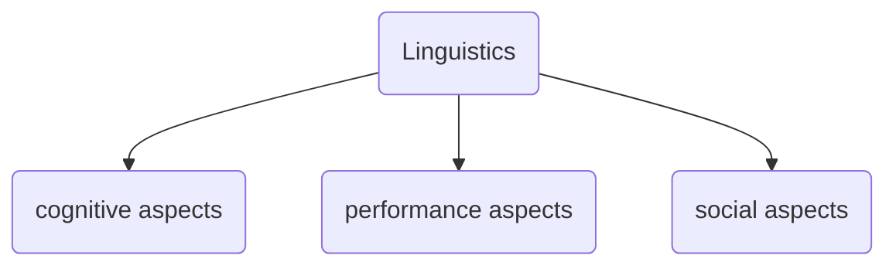
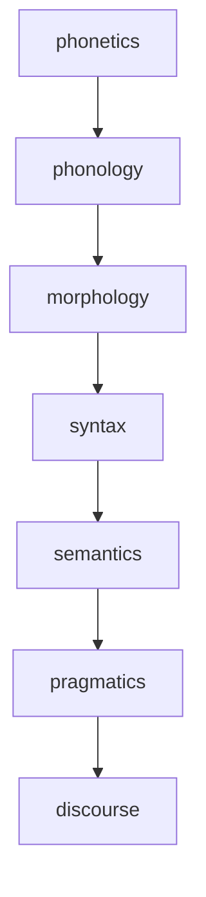
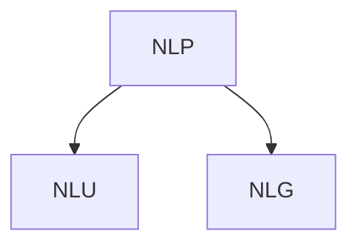
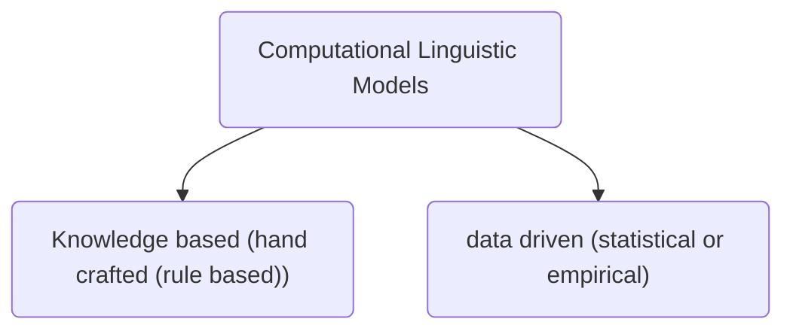
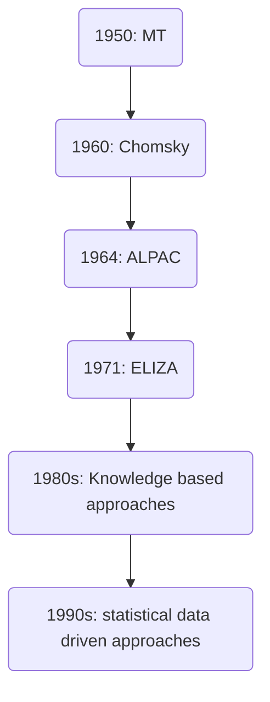
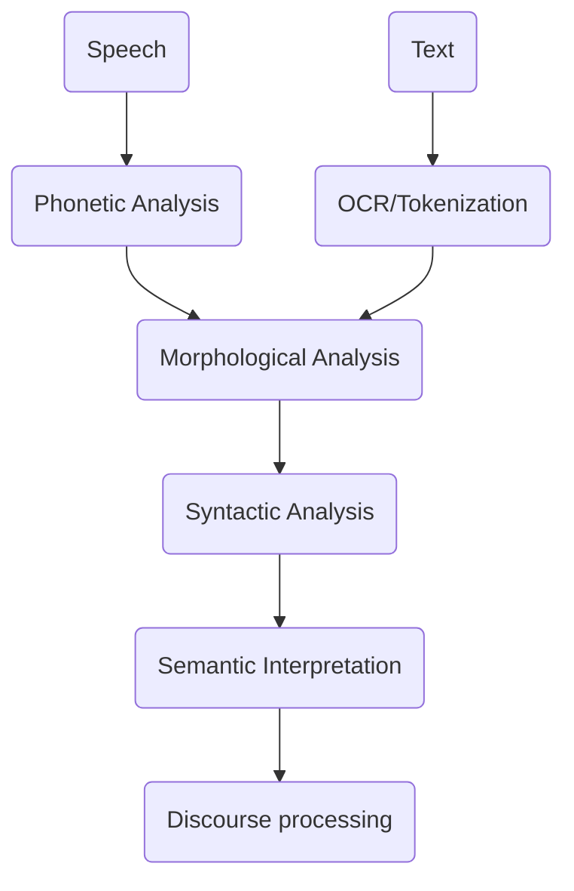

Language is ubiquitous and omnipresent. The usage of language changes entirely in different domains and settings.

Linguistics is a scientific study of language.

Different languages, dialects, and varieties of language may differ in many ways. But nouns and verbs are generally agreed upon to be universal.

Other names for/fields in CL
* NLP
* Language Engineering
* Human Language Technology

NLP: major role by computer engineers
CL: major role by linguists

NLU: natural language understanding: for the computer
NLG: natural language generation: by the computer

When humans translate the languages, they use 
* Linguistic Knowledge
* World Knowledge
* Domain Knowledge
* Contextual Knowledge
* Cultural Knowledge
Thus, machines also need to be given these knowledges while translating.

1964: ALPAC Report

**Analysis of Language in CL**

ASCII and ISCII

**Unicode**
In a the quintessential Indian abugida, there is a primary vowel (अ) which is inherent to all the characters. The removal of a vowel, or addition of a secondary vowel each have individual unicode characters.

Native language Identification

