# LAB 4

Name: Abhyudit Singh\
Roll no: 2023114009

1. Retrieve all customer information.

    ```sql
    select * from Customers;
    ```

    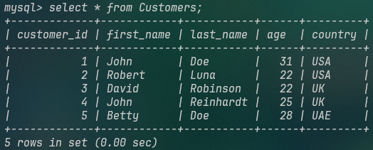

2. Retrieve all order details.

    ```sql
    select * from Orders;
    ```

    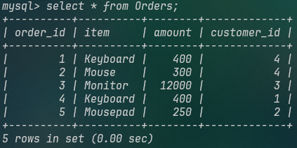

3. Retrieve all shipping details.

    ```sql
    select * from Shippings;
    ```

    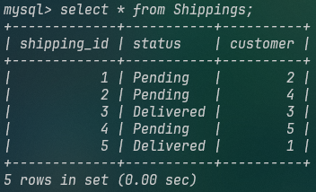

4. Find the total number of customers.

    ```sql
    select count(*) as total_customers from Customers;
    ```

    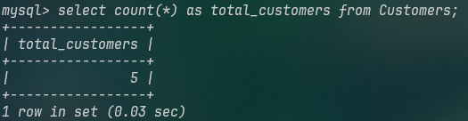

5. Find the average age of customers.

    ```sql
    select avg(age) as average_age from Customers;
    ```

    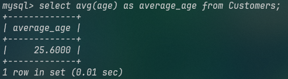

6. Find customers who have placed orders and their order details.

    ```sql
    select c.*, o.order_id, o.item, o.amount
    from Customers as c, Orders as o 
    where c.customer_id = o.customer_id;
    ```

    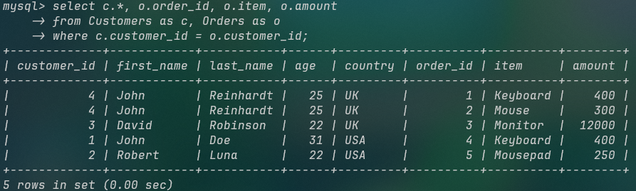

7. Retrieve customers who have not placed any orders.

    ```sql
    select * 
    from Customers 
    where customer_id not in (select customer_id from Orders);
    ```

    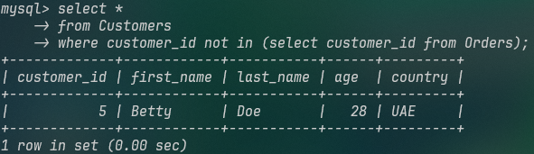

8. Find the customer with the highest total order amount.

    ```sql
    select c.*, t1.x as highest_total
    from (
        select customer_id, sum(amount) as x 
        from Orders 
        group by customer_id
    ) as t1, Customers as c 
    where t1.customer_id = c.customer_id
    and x = (
        select max(x) 
        from (
            select sum(amount) as x 
            from Orders 
            group by customer_id
        ) as t2
    );
    ```

    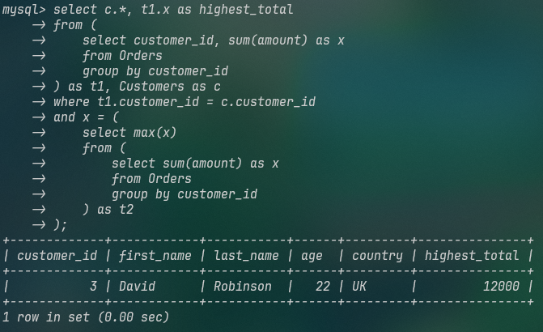

9. Retrieve the items ordered by customers from the UK.

    ```sql
    select o.item
    from Customers as c, Orders as o
    where c.country = 'UK'
    and c.customer_id = o.customer_id;
    ```

    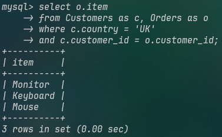

10. Find the status of orders placed by customers aged 25 or below.

    Only the shipping details:

    ```sql
    select s.*
    from Shippings as s, Customers as c 
    where c.age <= 25
    and c.customer_id = s.customer;
    ```

    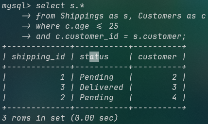

    Customer details are also visible:

    ```sql
    select s.shipping_id, s.status, c.*
    from Shippings as s, Customers as c 
    where c.age <= 25 
    and c.customer_id = s.customer;
    ```

    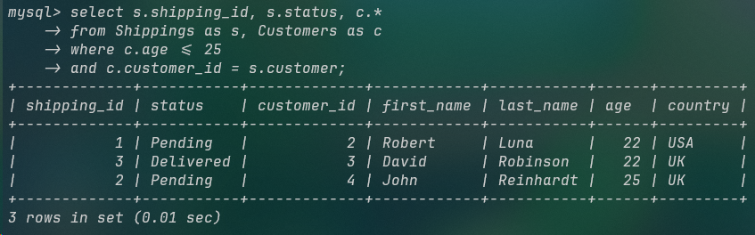
