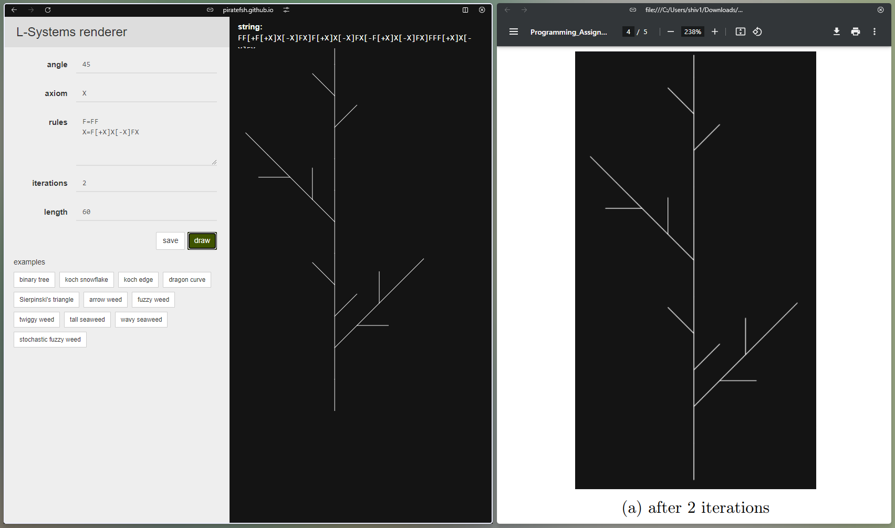

# Report

## Q2

All the L-Systems start while pointing upwards.\
Open [`index.html`](q2/index.html) in a browser to see the generated L-Systems.

### Images

#### Mirrorball (12 iterations)

#### Tree (4 iterations)

#### Anything (6 iterations)

#### Noise (9 iterations)

## Q3

### Stick Plant

### Santa

